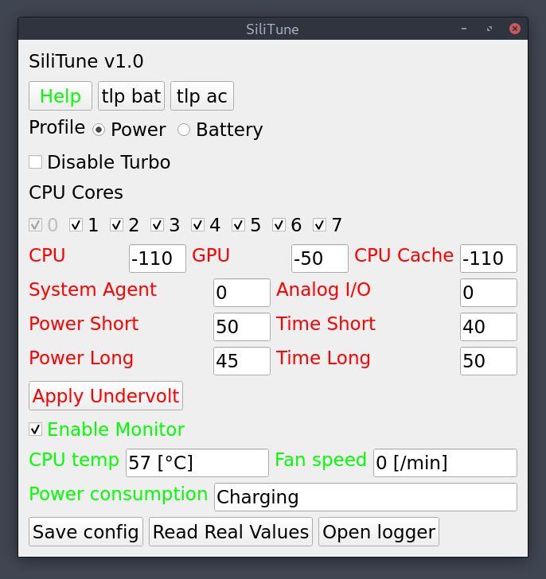

# SiliTune - the CPU Power Manager

**WARNING: Use as your own risk! See disclaimer for details!**

You want your laptop CPU works like a beast when your program is being run, and consume as less power as possible when you are on battery just browsing the net. You don't want to open a terminal and type a long command just to disable turbo boost. You don't want to open a terminal and wait for powertop just to see the power consumption.

With this program, you can control your CPU with just a click of mouse, automatically switch management profiles when power cable disconnected/connected, and monitor frequently-used parameters easily. 

A screenshot(A stable -125mV undervolting is quite lucky, not every CPU can get this far): 

Functions to be developed:

- [x] Friendly help and document, easy installation, app launcher
- [x] Easy TLP/~~PowerTOP(May cause USB mouse stop responding)~~ toggle
- [x] Enable/disable turbo boost
- [x] Turn on/off CPU cores
- [x] Undervolting and TDP level configuration(by `intel-undervolt`)
- [x] Auto switch profile, ~~handle ACPI events~~, continuous check (per certain seconds) for whether laptop is on AC or battery
- [x] Power consumption monitor, temperature/fan speed/frequency monitor
- [x] system tray icon for easy access and hide
- [x] Multiple tabs for more functions
- [x] Data acquisition & plotting
- [ ] Benchmark
- [ ] Auto tune(find max Q point)
- [ ] Package in AUR

## A Partial Usage Guide

#### **Dependencies**

The program is written in PyQt5, so you may need to install the python3 `pyqt5` libraries. 

TLP is required to monitor CPU and battery information. 

Undervolting functions depends on `intel-undervolt` module to work, which is available in AUR if you are using ArchLinux. 

Desktop launcher uses `gksudo` to launch GUI programs as root, so `gksudo`(may be in package `gksu`) should be available. 

#### **Installation**

First, check `install.sh` to see whether there are something wrong, or some files you don't want to override. 

Then run `install.sh` as root to install. 

The program will be installed to `/usr/local/silitune`.

Configure file and desktop launcher will be installed. Old configure file will be untouched. 

#### **Configure files**

`/etc/silitune/sili.conf` is the place of the main configure file used by silitune, an example can be found at `./sili.conf.example`. The meanings of entries in the file is obvious. The program, instead of you, will deal with it. In most cases you don't need to edit it by yourself. 

One exception: if you want to use the undervolting functions, then you should set `uv enabled = 1` in the `global` section in the configure file manually. 

`/etc/intel-undervolt.conf` and `/etc/intel-undervolt.conf.bak` is changed by the program for undervolting configurations. So backup the file to a name different from these two is recommended. 

#### **Launcher**

Be careful if you want to let the program auto launch in you desktop environment's settings, I encountered some problems when doing so. 

####  **Usage**

The GUI is quite simple to use. 

First, click Help and read it. 

If you don't know the meanings of buttons, like "What's turbo boost?", or "Whether should I change system agent", then you'd better look up before tweaking these options. 

**Options, and Save**

Changed options will have effects immediately(except undervolting settings), but only after pressing `Save config` will those changes written into configure file, or they;ll be discarded after quit. 

Power and Battery profiles are not saved simultaneously, so pressing the save button when on power profile will only save your power profile, and vise versa. Considering the mechanism of the program, it's nature to behave like this. 

As an incorrect undervolting may cause system failure, only after pressing the Apply Undervolt button will the undervolting settings be truly written into system. Check twice before press it. 

**Real Real Values**

If you entered an illegal value, or some buttons or options failed to work, the value on the panel will be the (bad) value your assigned, but actually the system is not modified. Press the read real values button will read the (good) values from system, then set them onto the panel. 

**Monitor**

Enabled monitor to view CPU, battery and fan information real-time. Monitor will not update if the app is hide to save power. 

**Data Acquisition**

Press `Start` and monitor data will be recorded in memory(old ones discarded), press `End` to end. Now the collected data is in RAM: press `Save` will save a plain text dump to (default) `/usr/local/silitune/data`. Press `Plot` to plot these the data in memory via matplotlib. 

**Logger**

Open logger, and see if anything wrong has happened. 

**Switch Profile**

The power and battery profiles are switched **automatically** when you connect/disconnect the power cable. 

**System Tray**

You can always right click the icon in system tray to hide or show the program, and switch profiles quickly. 

## Disclaimer

As is shown in the Arch Wiki, undervolting may cause "Instant hardware damage". I'm not responsible for any kind of damage or misbehavior(both you and your computer) caused by this program. 