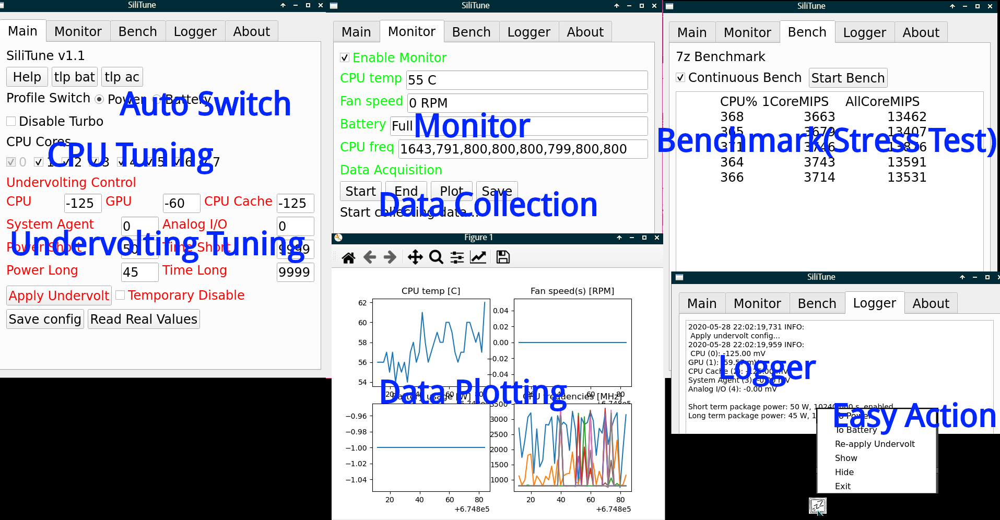

# SiliTune - the CPU Power Manager

**WARNING: Use as your own risk! See disclaimer for details!**

*This project has won the 3rd prize in the [13th National University Student Social and Science Contest on Energy Saving & Emission Reduction](http://www.jienengjianpai.org/Article.asp?ID=219)（第十三届全国大学生节能减排社会实践与科技竞赛，项目：Linux 节电大师）. Teammates: me, [libreliu](https://github.com/libreliu), [ZhaoZuohong](https://github.com/ZhaoZuohong), supervised by [Peng Hu](https://tsee.ustc.edu.cn/2010/0613/c3266a27763/pagem.psp)*

You want your laptop CPU works like a beast when your program is being run, and consume as less power as possible when you are on battery just browsing the net. You don't want to open a terminal and type a long command just to disable turbo boost. You don't want to open a terminal and wait for powertop just to see the power consumption.

With this program, you can control your CPU with just a click of mouse, automatically switch management profiles when power cable disconnected/connected, and monitor frequently-used parameters easily. 

A combined graph showing nearly all function:

Functions to be developed:

- [x] Friendly help and document, easy installation, app launcher
- [x] Easy TLP/~~PowerTOP(May cause USB mouse stop responding)~~ toggle
- [x] Enable/disable turbo boost
- [x] Turn on/off CPU cores
- [x] Undervolting and TDP level configuration(by `intel-undervolt`)
- [x] Auto switch profile, ~~handle ACPI events~~, continuous check (per certain seconds) for whether laptop is on AC or battery
- [x] Power consumption monitor, temperature/fan speed/frequency monitor
- [x] system tray icon for easy access and hide
- [x] Multiple tabs for more functions
- [x] Data acquisition & plotting
- [x] Benchmark
- [ ] Automatic full benchmark(see dev branch)
- [ ] Auto tune(find max Q point)
- [x] Package in AUR

#### Installation

**ArchLinux based distros**

`yay -S silitune`

**Ubuntu and others**

Just an example command list. Adjust them to satisfy your own condition. 

`apt install python3-pyqt5 python3-matplotlib tlp gksudo p7zip-full build-essentials git`

`git clone https://github.com/kitsunyan/intel-undervolt.git && `

`cd intel-undervolt && ./configure && make && sudo make install`

`git clone https://github.com/ustcpetergu/silitune`

`cd silitune && sudo ./install.sh`

`sudo ./uninstall.sh` to uninstall. 

#### Post-installation

Set `uv enabled = 1` in `/etc/silitune.conf` manually to enable undervolting. 

Uncomment the `power package 50/40 45/50`  line in `/etc/intel-undervolt.conf` to make TDP configure working. 

`/etc/intel-undervolt.conf` and `/etc/intel-undervolt.conf.bak` are changed by the program for undervolting and TDP configurations. So backup the file to a name different from these two is recommended. 

####  Misc. 

A launcher will be installed to `/usr/share/applications`, but whether it works depends on your DE. 

If you don't know the meanings of buttons, like "What's turbo boost?", or "Whether should I change system agent", then you'd better look up before tweaking these options. 

Changed options will have effects immediately(except undervolting settings), but only after pressing `Save config` will those changes written into configure file, or they'll be discarded after quit. 

Power and Battery profiles are not saved simultaneously, so pressing the save button when on power profile will only save your power profile, and vise versa. 

As an incorrect undervolting may cause system failure, only after pressing the Apply Undervolt button will the undervolting settings be truly written into system. Check twice before press it. Due to my experience, any operation related to undervolting change(like switch profile) may cause system crash, even change from a big value to a small one. 

If you entered an illegal value, or some buttons or options failed to work, the value on the panel will be the (bad) value your assigned, but actually the system is not modified. Press the read real values button will read the (good) values from system, then set them onto the panel. 

The power and battery profiles are switched **automatically** when you connect/disconnect the power cable, if your battery is successfully detected. And you can also switch by hand. 

You can always right click the icon in system tray to hide or show the program, switch profiles, and re-apply undervolt quickly. On my laptop undervolt will be reset to 0 after waking up from suspension, so the re-apply is useful. 

Enabled monitor to view CPU, battery and fan information real-time. Monitor will not update if the app is hide to save power. 

Press `Start` and monitor data will be recorded in memory(old ones discarded), press `End` to end. Now the collected data is in RAM: press `Save` will save a plain text dump to (default) `/var/lib/silitune`. Press `Plot` to plot these the data in memory via matplotlib, no matter saved or not. 

`plotter.py` can be used to plot saved data. Example: `./plotter.py /usr/local/silitune/data/silitune-######.#.dat`

Most of the parameters and command names are clearly visible at the top of `silitune.py` -- tune them if you need. 

## Disclaimer

As is shown in the Arch Wiki, misconfiguring CPU voltage may cause "Instant hardware damage". 

Though this has been tested on 6+ laptops and I use it every day without noticing any permanent damage, **I'm not responsible for any kind of damage or misbehavior(both you and your computer) caused by this program**. 
