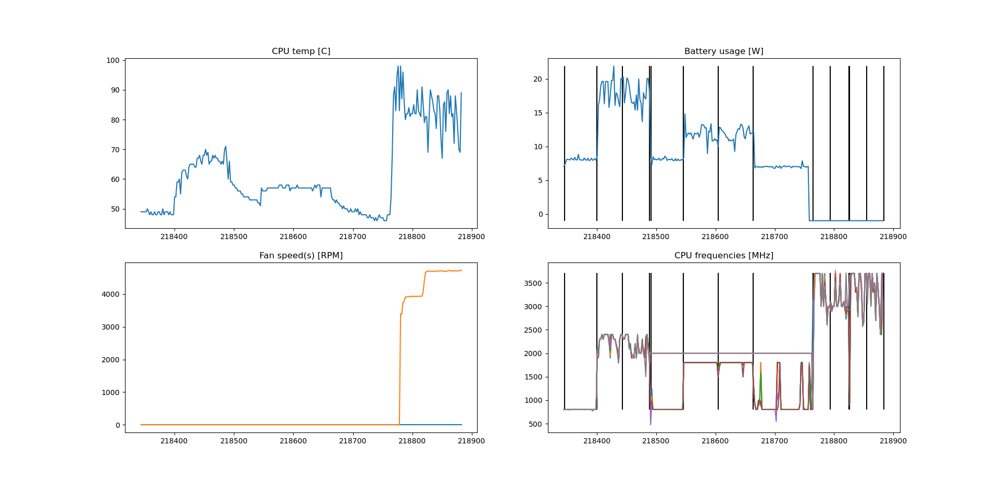
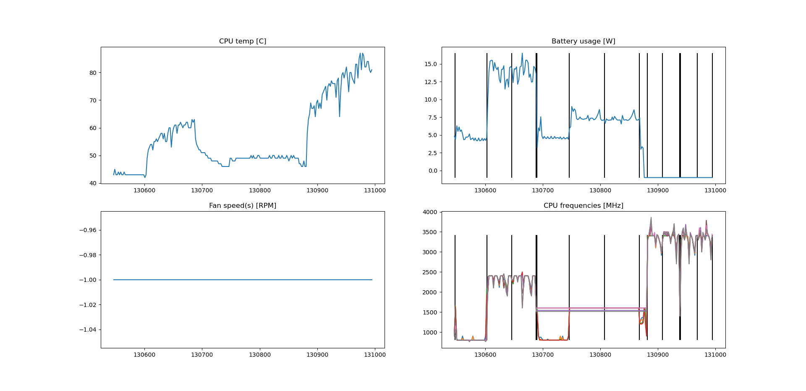
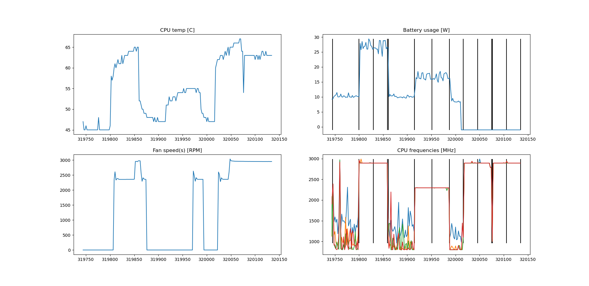
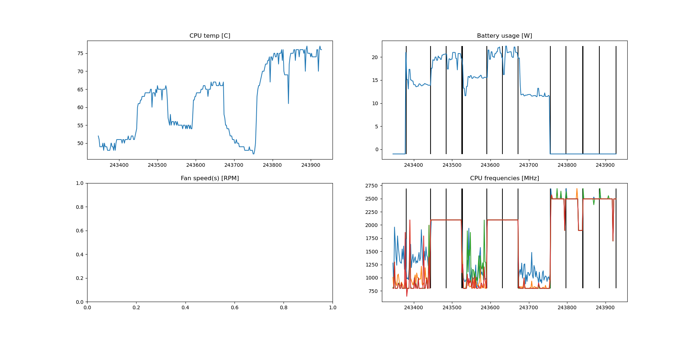

# bench report

test contribution: lzt, tyl, yxh, zzh 

## i7-8550u (my dell laptop)

从左到右分别是电池下一般情况播放视频、电池下7z（预热、正式）；电池下最大省电（降压、关锐睿频，关25%核）下播放视频、7z（预热、正式）；电源下正常情况下7z（预热，正式），电源降压下7z（预热，正式）

|                           | 电池（一般） | 电源（最大省电） | 电池（一般） | 电池（降压） |
| ------------------------- | ------------ | ---------------- | ------------ | ------------ |
| video                     | 8.07W        | 8.06W            | --           | --           |
| 7z（正式），功耗/单核性能 | 17.68W/2539  | 11.84W/2066      | --/3584      | --/3835      |
| undervolting -125mV       |              |                  |              |              |

对video没影响就不说了，降压在满载下节能效果更明显

电池下，关睿频+降压在性能损失19%下节能33%

电源下，降压提高性能7%，功耗不变（撞功耗墙，23W）

## i5-10210U (yxh's XPS13)

|                           | 电池（一般） | 电源（最大省电） | 电池（一般） | 电池（降压） |
| ------------------------- | ------------ | ---------------- | ------------ | ------------ |
| video                     | 4.72W        | 4.73W            | --           | --           |
| 7z（正式），功耗/单核性能 | 14.04W/2634  | 7.25W/1996       | --/3644      | --/3732      |
| undervolting -75mV        |              |                  |              |              |

电池下，关睿频+降压在性能损失24%下节能48%

电源下，降压提高性能2.4%

## i7-5500u (another dell inspiron laptop)

|                                             | 电池（一般） | 电源（最大省电） | 电池（一般） | 电池（降压） |
| ------------------------------------------- | ------------ | ---------------- | ------------ | ------------ |
| video                                       | 10.22W       | 10.10W           | --           | --           |
| 7z（正式），功耗/单核性能                   | 26.78W/2419  | 16.69W/1988      | --/2417      | --/2426      |
| undervolting -95mV, TDP modification failed |              |                  |              |              |

电池下，关睿频+降压在性能损失19%下节能38%

电源下，降压提高性能0.4%，因为主要是TDP没有调上来，thermal throttle比较严重

## a 4th gen CPU (tyl's laptop)

 奇怪的数据增加了

